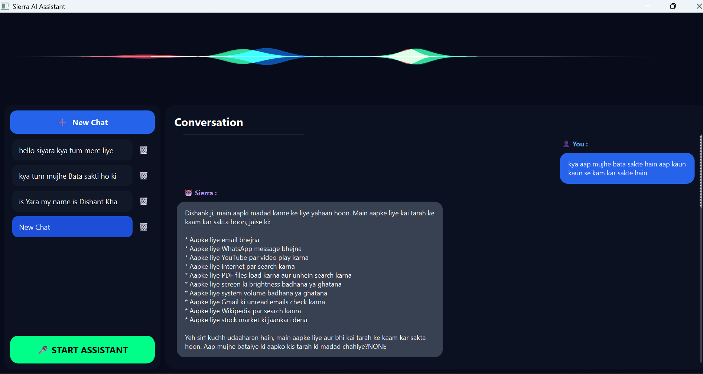
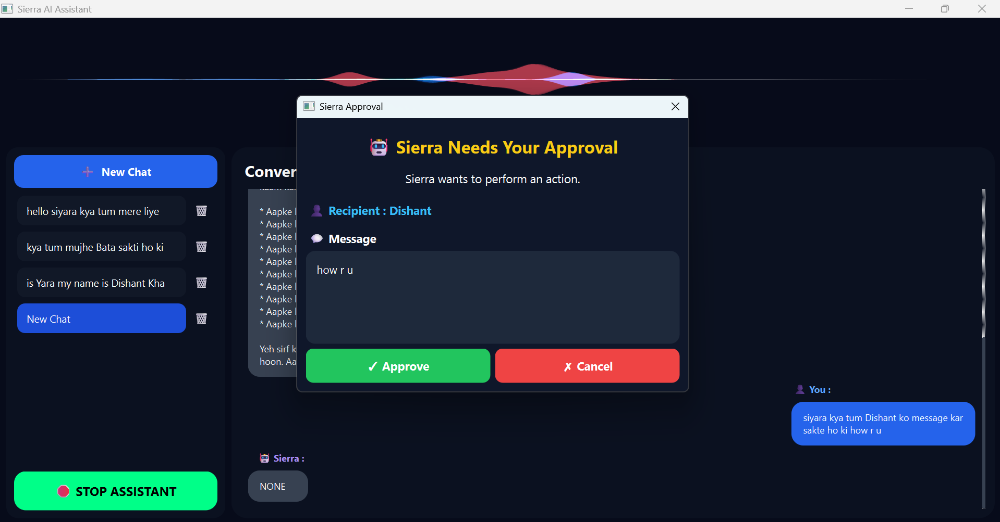

# 🎙️ AI Desktop Voice Assistant

An intelligent AI-powered desktop voice assistant built using **Python, LangGraph, LangChain, Gemini, ChromaDB, and Tkinter**. The assistant can perform desktop automation, maintain conversational memory, execute tools, and provide a modern interactive GUI with real-time voice interaction.

---

## ✨ Features

### 🤖 AI Conversation
- Natural language conversations using **Google Gemini**
- Context-aware responses
- Multi-turn conversation support
- Intelligent reasoning using **LangGraph**

### 🧠 Persistent Memory
- Stores previous conversations
- Semantic memory using **ChromaDB**
- SQLite-based chat history
- Retrieves relevant past conversations for better responses

### 🎤 Voice Assistant
- Speech-to-Text input
- Text-to-Speech responses
- Hands-free interaction
- Continuous voice conversation support

### 🖥️ Desktop Automation
- Open desktop applications
- Launch websites
- Execute system commands
- Tool-based task execution

### 🌐 Web Search
- Internet search support
- Real-time information retrieval
- Intelligent query handling

### ⚡ Multithreading
- Responsive GUI while processing AI requests
- Background execution for voice recognition
- Non-blocking tool execution
- Smooth user experience

### 🎨 Modern Frontend
- Interactive desktop interface built using **Tkinter**
- Chat window
- User-friendly layout
- Real-time message updates
- Clean and responsive UI

### 🔧 Tool Calling
The assistant can intelligently decide when to use tools for tasks such as:

- Opening applications
- Searching the web
- Performing desktop actions
- Memory retrieval
- Utility operations

---

# 🏗️ Project Architecture

```
User
   │
   ▼
Frontend (Tkinter GUI)
   │
   ▼
Speech Recognition
   │
   ▼
LangGraph Workflow
   │
 ┌─┴──────────────┐
 │                │
 ▼                ▼
Groq LLM     Tool Executor
 │                │
 ▼                ▼
Memory      Desktop Automation
 │
 ▼
ChromaDB + SQLite
```

---

# 🛠️ Tech Stack

## Programming Language

- Python 3.13

## AI Framework

- LangChain
- LangGraph

## Large Language Model

- Groq LLM

## Vector Database

- ChromaDB

## Database

- SQLite

## Frontend

- pySide6QT

## Voice Processing

- SpeechRecognition
- pyttsx3
- Edge-TTS

## Utilities

- Threading
- OS
- Requests
- Dotenv

---

# 📂 Project Structure

```
AI_DESKTOP_ASSISTANT/
│
├── voice.py
├── graph.py
├── memory_store.py
├── Tools.py
├── frontend.py
├── requirements.txt
├── README.md
│
├── chroma_db/      (ignored)
├── chatbot.db      (ignored)
│
└── assets/
```

---

# 🚀 Key Highlights

✅ AI-powered desktop assistant

✅ Persistent conversational memory

✅ Semantic search using ChromaDB

✅ LangGraph workflow orchestration

✅ Tool calling architecture

✅ Voice-enabled interaction

✅ Responsive Tkinter GUI

✅ Multi-threaded execution

✅ Modular project structure

✅ Easily extendable with new tools

---

# ⚙️ Installation

## Clone Repository

```bash
git clone https://github.com/yourusername/AI-Desktop-Voice-Assistant.git
cd AI-Desktop-Voice-Assistant
```

## Create Virtual Environment

```bash
python -m venv venv
```

Activate

Windows

```bash
venv\Scripts\activate
```

Linux / Mac

```bash
source venv/bin/activate
```

## Install Dependencies

```bash
pip install -r requirements.txt
```

## Create Environment Variables

Create a `.env` file

```env
GOOGLE_API_KEY=YOUR_API_KEY
```

---

# ▶️ Run the Project

```bash
python -m frontend.app
```

---

# 📸 Application Preview


## Home Screen



## Chat Window


```

---

# 🎯 Future Improvements

- Authentication
- Wake-word detection
- Calendar integration
- Email automation
- Smart reminders
- File management
- OCR support
- Vision power

---

# 👨‍💻 Author

**Dishant Khatri**

GitHub: https://github.com/24f2008789

LinkedIn: https://linkedin.com/in/dishant-khatri-a97204360

---

# ⭐ If you like this project

Give this repository a ⭐ on GitHub!